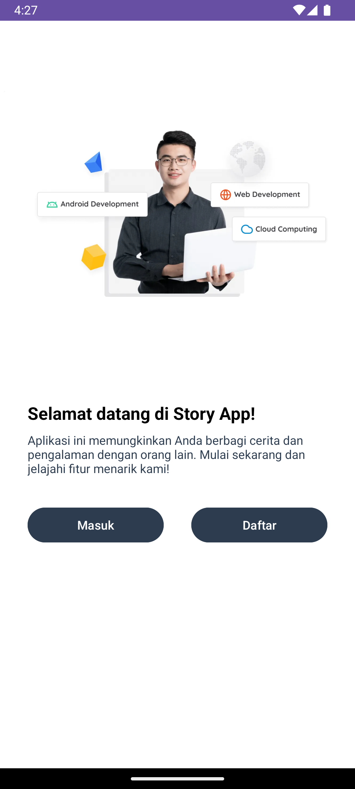
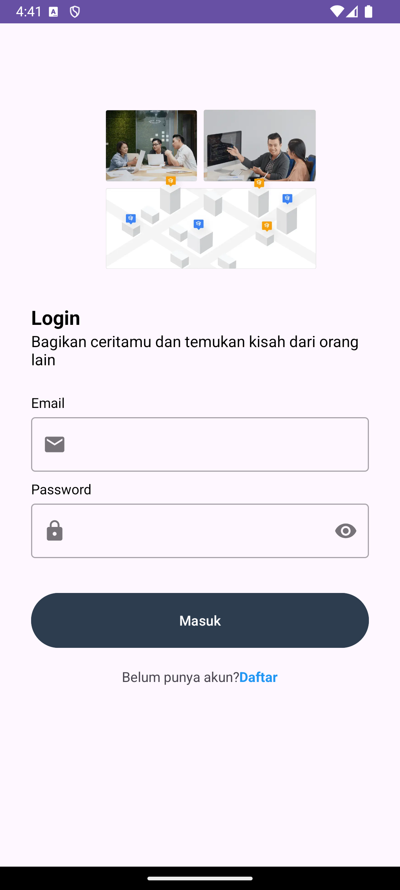
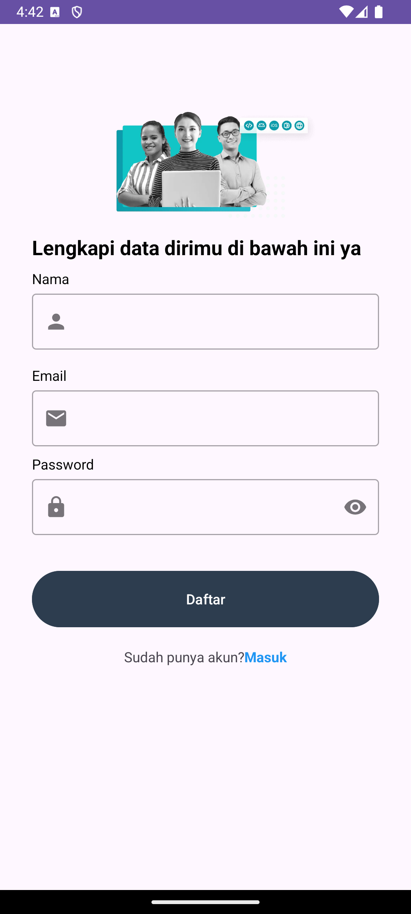
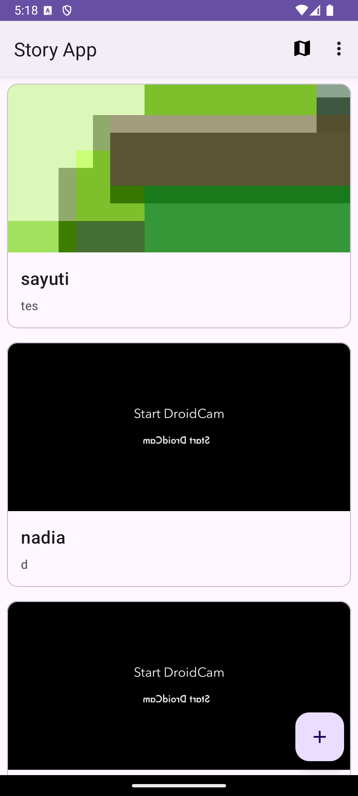
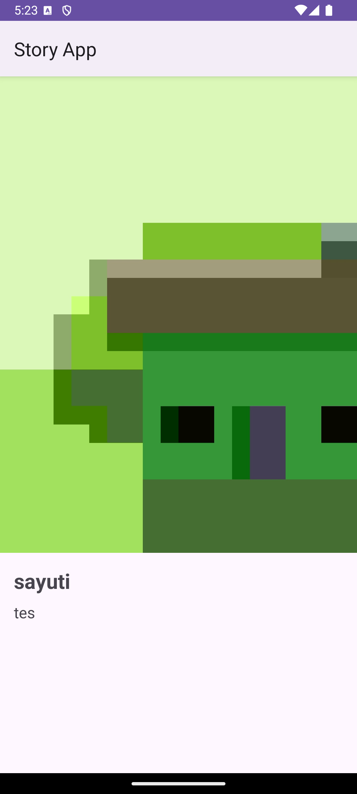
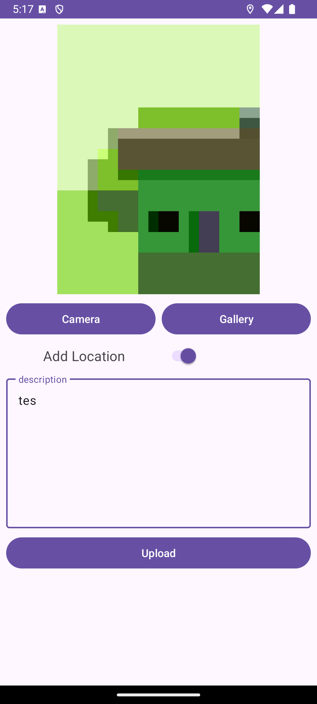
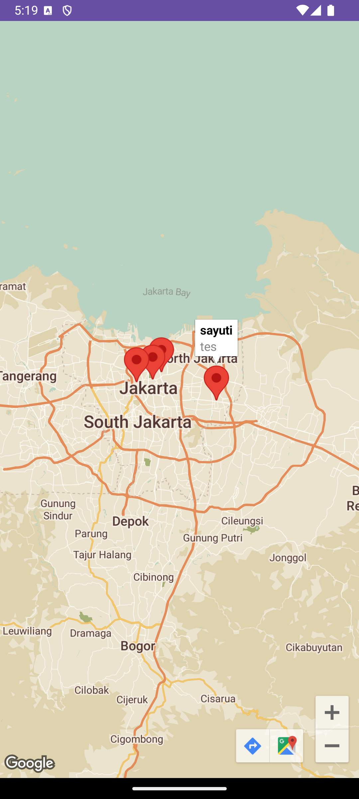

# Story App MVVM

### Overview
Story App is an application that displays a list of stories from users, where each story item includes an image,
the name of the user who posted it, and a description. Users can add new stories along with location data.
The maps page shows a map with markers indicating the locations of the story posts.

### Preview  
<table align="start">
  <tr>
    <td align="center">
       
      <b>Welcome</b>
    </td>
    <td align="center">
       
      <b>Login</b>
    </td>
    <td align="center">
       
      <b>Register</b>
    </td>
    <td align="center">
       
      <b>Home</b>
    </td>
  </tr>
  <tr>
    <td align="center">
       
      <b>Detail</b>
    </td>
    <td align="center">
       
      <b>Add Story</b>
    </td>
    <td align="center">
       
      <b>Maps</b>
    </td>
  </tr>
</table>

## Tech Stack
- **Kotlin** – Primary language for Android development.
- **MVVM Architecture** – Using ViewModel, LiveData, and Repository pattern.
- **Hilt** – For dependency injection.
- **Retrofit + OkHttp + Gson** – API integration and JSON parsing.
- **Room + DataStore Preferences** – Local storage for session and token.
- **Paging 3 + RemoteMediator** – Efficient story listing with offline support.
- **Google Maps SDK + Fused Location** – Display story maps and fetch user location.
- **Glide** – Image loading from API.
- **CameraX & Image Picker** – Capture photos via camera or select from gallery.
- **Custom Views** – Real-time validation for email and password fields.
- **Animations** – Property Animation, Motion, or Shared Element for smooth UI.
- **Testing** – JUnit, Mockito for unit tests; Espresso + Idling Resource for UI tests.
- **Material Components + ConstraintLayout** – Modern and responsive UI design.
